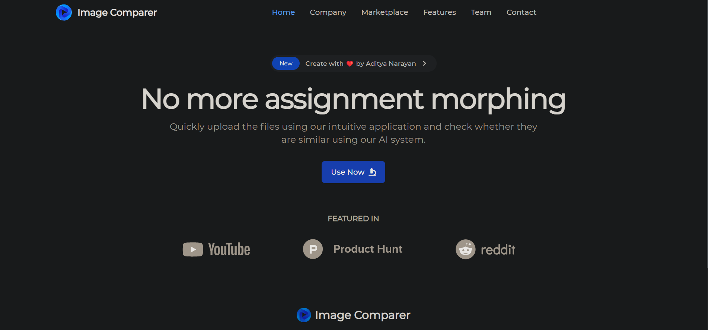
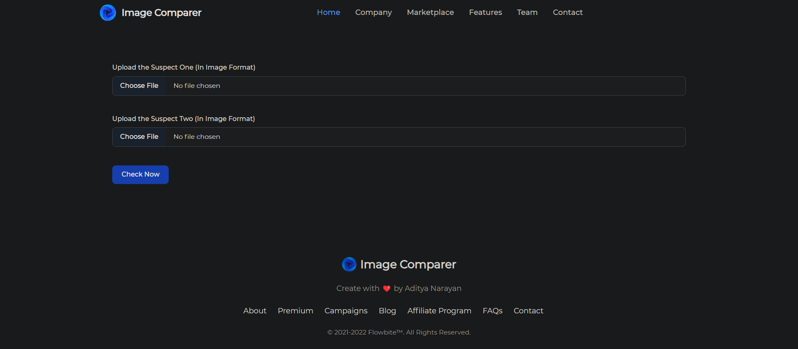

### Project Title: ImageComparer  Web App

Description:
The ImageComparer Web App is a full-stack web application built using the following technologies: HTML, CSS, Node.js, Express.js, EJS, and an external API. The main objective of this project is to provide users with a platform to compare the similarity between two images and obtain a similarity score.

Key Features:

* User-friendly interface: The web app has an intuitive and visually appealing user interface, allowing users to easily interact with the application.
* Image upload: Users can upload two images through a form on the web app.
* Image similarity analysis: The uploaded images are processed using an external API, specifically the DeepAI API, to calculate the similarity score between the two images.
* Score display: The similarity score is presented to the user in a clear and understandable format.
* Multiple file upload support: The web app supports simultaneous upload of two images for comparison.
* Real-time processing: The image similarity analysis is performed asynchronously, ensuring a smooth user experience.
* Scalability: The project is built using a scalable architecture, allowing for future enhancements and additional features.

Tech Stack:

* Front-end: HTML, CSS
* Back-end: Node.js, Express.js
* Template Engine: EJS (Embedded JavaScript)
* File Upload: Multer
* External API: DeepAI API

How to Use:

1. Access the web app: Open a web browser and navigate to the URL where the web app is hosted.
2. Upload images: Use the provided form to upload two images for comparison. Ensure that the images are in a supported format.
3. Processing: The web app will process the uploaded images using the DeepAI API to calculate the similarity score.
4. View results: Once the processing is complete, the similarity score will be displayed on the screen, providing an insight into the similarity between the two images.

Future Enhancements:

* User authentication: Implement user authentication and authorization to secure the web app and allow personalized experiences.
* Image gallery: Introduce a feature to store and manage uploaded images, enabling users to view their previously uploaded images.
* Image metadata: Extract and display additional information about the uploaded images, such as dimensions, file size, and EXIF data.
* Improved UI/UX: Enhance the user interface and experience with more interactive elements, animations, and responsiveness.
* Error handling: Implement robust error handling mechanisms to provide informative error messages and handle various edge cases.
* Performance optimization: Optimize the application's performance by implementing caching mechanisms and optimizing API requests.

Overall, the ImageComparer Score Web App demonstrates the ability to develop a full-stack web application using modern technologies and showcases skills in front-end design, back-end development, API integration, and data processing.

Some Screenshots of the App:

